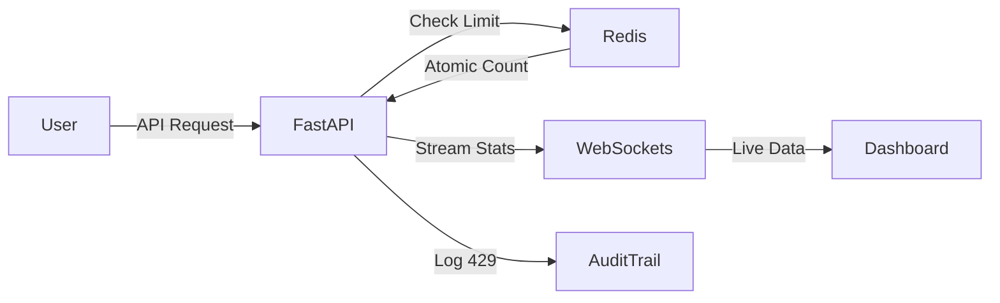

# 🚀 Enterprise Rate Limiter & Monitoring Suite

The **Enterprise Rate Limiter & Monitoring Suite** is a high-concurrency, distributed API management solution. It provides granular rate control via Redis and real-time system observability, designed for engineers who need to monitor API health and throughput in mission-critical environments.

---

## 🏗️ System Architecture
The suite utilizes an event-driven architecture, separating the request-handling pipeline from the real-time observability bus.

## Components:
API Gateway Layer (FastAPI): Handles incoming requests and enforces policy via middleware.

State Engine (Redis): Manages atomic counters via Lua scripts for thread-safe rate enforcement.

Telemetry Bus (WebSockets): Streams server-side health metrics (psutil) to the dashboard.

Audit Layer: Captures and logs 429 Too Many Requests status codes for forensic analysis.

## Key Capabilities
Atomic Rate Enforcement: Eliminates "race conditions" common in standard rate limiters by utilizing Redis-Lua atomicity.

Real-time Observability: A live-updating dashboard visualizing CPU and memory pressure.

Forensic Audit Trail: Real-time logging of blocked requests, allowing for instant identification of API abuse.

Dynamic Configuration: Adjust global API rate limits in real-time without server restarts.

Modern UI: Responsive, Tailwind-powered interface with persistent Dark/Light mode.

## Getting Started
1. Prerequisites
Redis Server: Ensure redis-server is installed and active on localhost:6379.

Python: Version 3.11+.

2. Installation
PowerShell
# Initialize and activate virtual environment
python -m venv venv
.\venv\Scripts\activate

# Install core dependencies
pip install fastapi uvicorn redis pydantic-settings psutil
3. Execution
Launch the production-ready server:

PowerShell
python -m uvicorn src.main:app --reload
Access the Enterprise Control Center at http://127.0.0.1:8000.

## Monitoring & Audit Logs
The dashboard is split into three functional panes:

System Health: Real-time CPU monitoring to detect resource exhaustion.

Configuration: Global limit management.

Audit Trail: An append-only log of all triggered rate limits, providing immediate visual feedback on API traffic anomalies.

 Roadmap
* Multi-node Cluster Support: Extend Redis logic for cross-region synchronization.

* Authentication: Add JWT/OAuth2 for administrative access.

* Persistent Storage: Dump audit logs into PostgreSQL for historical analysis.